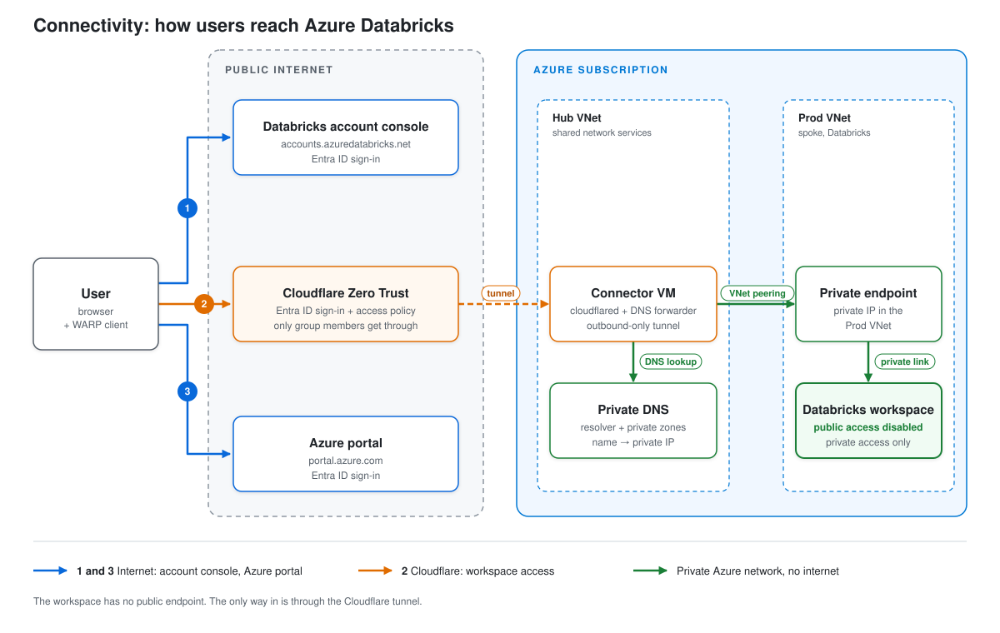

<h1 align="center">terragrunt-azure-databricks</h1>

<p align="center">
  Infrastructure as Code (IaC) using Terragrunt and Terraform for enterprise Azure Databricks deployments.<br>
  Implements a secure network boundary with data exfiltration protection (DEP), private endpoints, and strict network controls.
</p>

<p align="center">
  <a href="https://www.terraform.io"></a>
  <a href="https://terragrunt.gruntwork.io"></a>
  <a href="https://azure.microsoft.com"></a>
  <a href="https://www.databricks.com"></a>
</p>

<p align="center">
  <a href="LICENSE"></a>
  <a href="CONTRIBUTING.md"></a>
  <a href="CODE_OF_CONDUCT.md"></a>
  <a href="SECURITY.md"></a>
</p>

## Prerequisites

Tools, Azure roles, Databricks and Cloudflare accounts, and MFA setup you need before you start. Follow [docs/prerequisites.md](docs/prerequisites.md).

## Deploy the platform in 3 steps

### Step 1: Bootstrap the state backend

Terraform state for this repo is stored in an Azure storage account. If you don't have one, create it first with [01bootstrap](01bootstrap). Follow [docs/bootstrap.md](docs/bootstrap.md).

If you already have a storage account for Terraform state, skip this step.

### Step 2: Configure the environments

Copy every `.example` file without the `.example` suffix, then follow the comments in each file to set your values (subscription ID, tenant ID, user emails, and so on). Follow [docs/configure.md](docs/configure.md).

### Step 3: Deploy the stacks

Generate, plan and apply the `hub` stack first, then the `prod` stack (`prod` depends on `hub`). Follow [docs/deploy.md](docs/deploy.md).

### Step 4: Sign in

There are three ways in. Only the workspace goes through Cloudflare.



| # | What | How you connect |
|---|---|---|
| 1 | Databricks account console | Over the internet. Open [accounts.azuredatabricks.net](https://accounts.azuredatabricks.net) and sign in with Entra ID and complete MFA. |
| 2 | Databricks workspace | Through Cloudflare only. The workspace has no public access. See below. |
| 3 | Azure portal | Over the internet. Open [portal.azure.com](https://portal.azure.com) and sign in with Entra ID and complete MFA. |

#### Sign in to the workspace

1. Ask an admin to add you to the Entra ID group `zero-trust-private-access` (`access_group_name` in `hub`'s `terragrunt.stack.hcl`).
2. Install the [Cloudflare WARP client](https://one.one.one.one).
3. In WARP, go to Preferences > Account > Login to Cloudflare Zero Trust, enter your team name, and sign in with Entra ID and complete MFA.
4. Get the workspace URL:

   ```bash
   az databricks workspace list --query "[].workspaceUrl" -o tsv
   ```

5. With WARP connected, open `https://<workspaceUrl>` in your browser.

If the page doesn't load, check that WARP shows **Connected** and that you're in the group from step 1.
