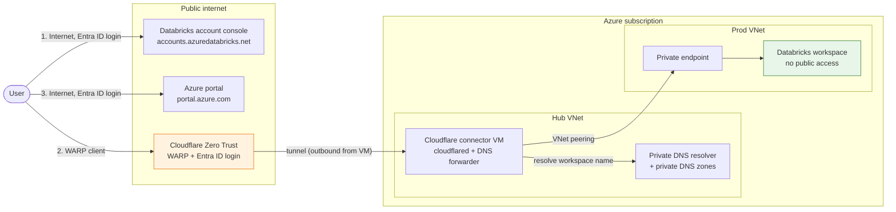

<h1 align="center">terragrunt-azure-databricks</h1>

<p align="center">
  Infrastructure as Code (IaC) using Terragrunt and Terraform for enterprise Azure Databricks deployments.<br>
  Implements a secure network boundary with data exfiltration protection (DEP), private endpoints, and strict network controls.
</p>

<p align="center">
  <a href="https://www.terraform.io"></a>
  <a href="https://terragrunt.gruntwork.io"></a>
  <a href="https://azure.microsoft.com"></a>
  <a href="https://www.databricks.com"></a>
</p>

<p align="center">
  <a href="LICENSE"></a>
  <a href="CONTRIBUTING.md"></a>
  <a href="CODE_OF_CONDUCT.md"></a>
  <a href="SECURITY.md"></a>
</p>

## Prerequisites

Have all of this ready before you start.

### Tools

- `terraform` >= 1.9
- `terragrunt` >= 1.1.1
- `az` CLI, signed in with `az login`

### Azure subscription

- **One subscription** works for both `hub` and `prod`. This is what the examples assume, because this repo was built and tested on a single free-tier subscription. Set `subscription_id` and `hub_subscription_id` to the same value.
- **Two subscriptions** is better for production: put `hub` in a connectivity subscription and `prod` in its own. Set `hub_subscription_id` in `prod`'s `root.hcl` to the hub's ID.
- Register these resource providers in each subscription:

  ```bash
  for p in Microsoft.Databricks Microsoft.Network Microsoft.Storage Microsoft.KeyVault \
           Microsoft.OperationalInsights Microsoft.Compute Microsoft.Insights; do
    az provider register --namespace $p
  done
  ```

- Enough quota in your region for a small Linux VM (the Cloudflare connector). If the VM size isn't available, change `vm_size` in the `cloudflare-zero-trust` module.

### Azure RBAC role (who runs Terraform)

- `Owner` on the subscription, or `Contributor` plus `User Access Administrator`. The code creates role assignments, so `Contributor` alone fails.

### Microsoft Entra ID roles (who runs Terraform)

- `Groups Administrator`: creates the Entra ID groups and manages their members
- `Application Administrator`: creates the Cloudflare Access app registration
- `Privileged Role Administrator` or `Global Administrator`: grants admin consent for `Directory.Read.All` on that app registration

### Databricks

- An Azure Databricks **account** with you as **account admin**. Sign in at [accounts.azuredatabricks.net](https://accounts.azuredatabricks.net).
- Your **Databricks account ID** (account console, click your user name, top right). It goes in `prod`'s `root.hcl`.

### Cloudflare

- A Cloudflare account with **Zero Trust** enabled (the free plan works) and a **team name** set (Zero Trust > Settings > Team name).
- Your Cloudflare **account ID** (Account home > Account ID).
- A Cloudflare **API token** with these Account permissions:
  - `Zero Trust`: Edit
  - `Access: Apps and Policies`: Edit
  - `Access: Organizations, Identity Providers, and Groups`: Edit
  - `Cloudflare Tunnel`: Edit

  Export it before you deploy `hub`:

  ```bash
  export CLOUDFLARE_API_TOKEN=<your token>
  ```

- Users who will connect need the Cloudflare **WARP** client installed.

### Other

- An Entra ID user (UPN) for each person who goes in a reader, contributor or Unity Catalog group.

## Deploy the platform in 3 steps

### Step 1: Bootstrap the state backend

Terraform state for this repo is stored in an Azure storage account. If you don't have one, create it first with [01bootstrap](01bootstrap). Follow [docs/bootstrap.md](docs/bootstrap.md).

If you already have a storage account for Terraform state, skip this step.

### Step 2: Configure the environments

Copy every `.example` file without the `.example` suffix, then follow the comments in each file to set your values (subscription ID, tenant ID, user emails, and so on). Follow [docs/configure.md](docs/configure.md).

### Step 3: Deploy the stacks

Generate, plan and apply the `hub` stack first, then the `prod` stack (`prod` depends on `hub`). Follow [docs/deploy.md](docs/deploy.md).

### Step 4: Sign in

There are three ways in. Only the workspace goes through Cloudflare.



| # | What | How you connect |
|---|---|---|
| 1 | Databricks account console | Over the internet. Open [accounts.azuredatabricks.net](https://accounts.azuredatabricks.net) and sign in with Entra ID. |
| 2 | Databricks workspace | Through Cloudflare only. The workspace has no public access. See below. |
| 3 | Azure portal | Over the internet. Open [portal.azure.com](https://portal.azure.com) and sign in with Entra ID. |

#### Sign in to the workspace

1. Ask an admin to add you to the Entra ID group `zero-trust-private-access` (`access_group_name` in `hub`'s `terragrunt.stack.hcl`).
2. Install the [Cloudflare WARP client](https://one.one.one.one).
3. In WARP, go to Preferences > Account > Login to Cloudflare Zero Trust, enter your team name, and sign in with Entra ID.
4. Get the workspace URL:

   ```bash
   az databricks workspace list --query "[].workspaceUrl" -o tsv
   ```

5. With WARP connected, open `https://<workspaceUrl>` in your browser.

If the page doesn't load, check that WARP shows **Connected** and that you're in the group from step 1.
